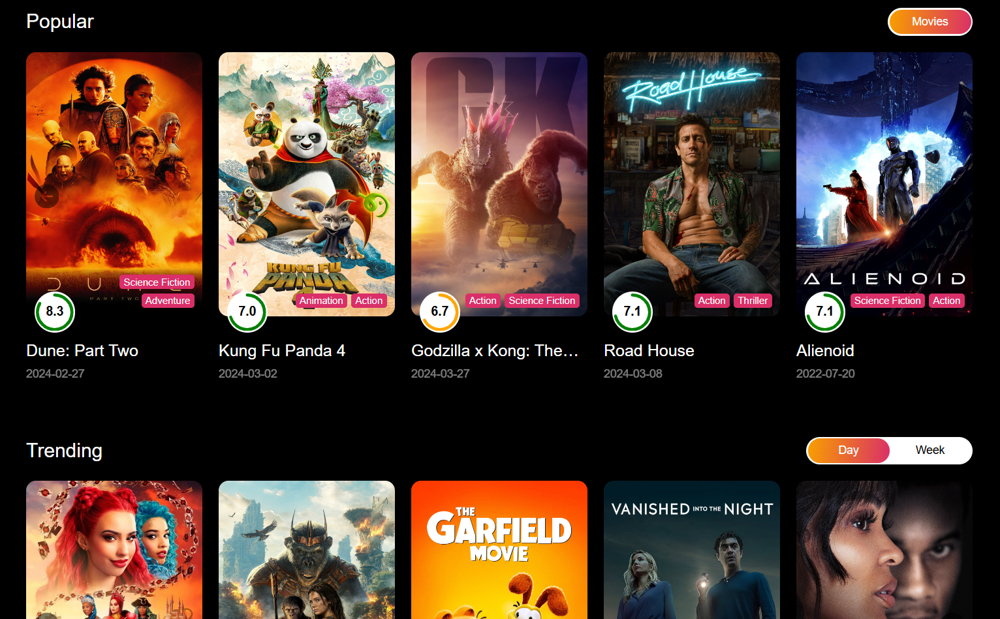

# The graduation project: Movie System

# Technologies:

- Microservice Architecture
- Framework: ExpressJs, React, FastApi
- Docker, Google Cloud Storage, Google Bigquery
- Database: MongoDB, Redis
- Other: Kafka, Nginx, Elasticsearch, Pytorch

# Architecture

## System architecture

## Data pipeline

# Preview website

## Client website

## Admin website

